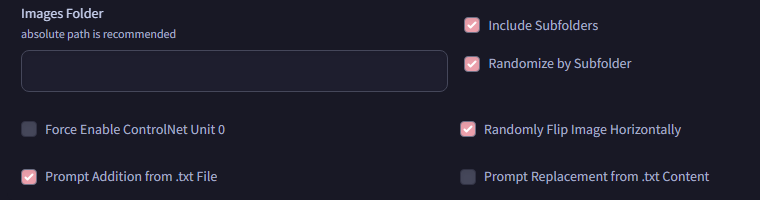

# SD Forge Random ControlNet
This is an Extension for the Forge Webui, which randomly selects an image from a specified folder as the input of ControlNet every generation.

> Support [Forge](https://github.com/lllyasviel/stable-diffusion-webui-forge), [reForge](https://github.com/Panchovix/stable-diffusion-webui-reForge), [Forge Classic](https://github.com/Haoming02/sd-webui-forge-classic), and probably [Automatic1111 Webui](https://github.com/AUTOMATIC1111/stable-diffusion-webui)

<p align="center"></p>

## How to Use
1. Enable the `Random ControlNet` Extension
2. Enter a path to a folder containing the detected maps
3. Adjust the ControlNet Unit **0** as needed *(**ie.** the Model)*
    - You do not need to provide an input image for it
4. Every time you generate, this Extension will automatically select a random image from the folder as the input for ControlNet Unit **0**

## Parameters

- **Images Folder:** Path to the folder containing the images
  - Supports `.jpg`, `.jpeg`, `.png`, `.webp` images
- **Include Subfolders:** Enable to also load images in subfolders under the `Images Folder`; Disable to only load images directly under `Images Folder`
- **Randomize by Subfolder:** Enable to split the selection into 2 phases: first by subfolder; then by image; Disable to select from all images at once
- **Force Enable:** Automatically enable the Unit **0**
- **Random Flip:** Has a 50% chance to flip the image horizontally 
- **Prompt Addition:** You can save the description of each image to a `.txt` file with the same filename
  - During every generation, this Extension will look for a `.txt` file with the same filename as the selected image, then add its content to the end of the positive prompt
  - If such `.txt` file is not found, it will also look for a `default.txt` file under the same folder
- **Prompt Replacement:** Same as above, but instead replaces any occurrence of "`RNG`" within the positive prompt with the content
  - *(without the quotation marks)*

#### Example Folder

```
- Poses/
  |- pose_a.png
  |- pose_a.txt - "sitting"
  |- pose_b.jpg
  |- pose_b.txt - "standing"
  |- pose_c.jpeg
  |- default.txt - "posing"
```
